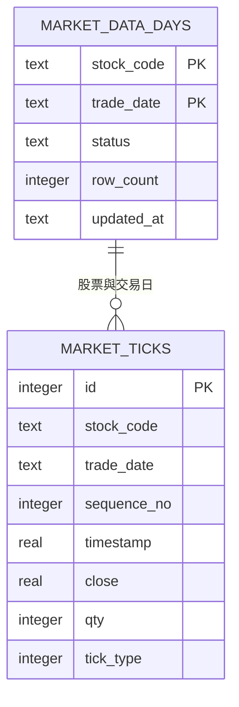

# 本地股票歷史資料庫說明

## 目的

原本每次回測、每個策略都逐日向外部 API 抓取 tick，六個策略會重複下載完全相同的聯電資料。本版改成 SQLite 快取：缺少的日期才抓取，抓到後立即寫入本機；下一個策略直接讀資料庫。

## 程式實際使用的資料表



- `market_data_days`：記錄某股票、某日期是否已完整下載。休市日可以是完成且 `row_count = 0`。
- `market_ticks`：保留回放策略需要的逐筆成交資料與原始順序。
- 唯一鍵 `(stock_code, trade_date, sequence_no)` 避免同一天重複插入。

## 更新流程

1. `update_data.py` 逐日查詢 `market_data_days`。
2. 已完成日期直接讀取，不連外。
3. 缺少日期才呼叫 Shioaji。
4. 成功取得資料（包含正常的空資料）後，以交易方式寫入兩張表。
5. API 例外不標示完成，下一次執行會重試。

```powershell
python update_data.py --profile 2303_ma
```

六策略批次回測執行 `python run_batch.py` 即可；第一個策略會補齊缺少資料，後五個策略共用相同 SQLite 資料。`database/ai_stock_system.sql` 另附 MariaDB 版的 `market_data_days` 與 `market_ticks` 結構，供日後整合網站後端。
